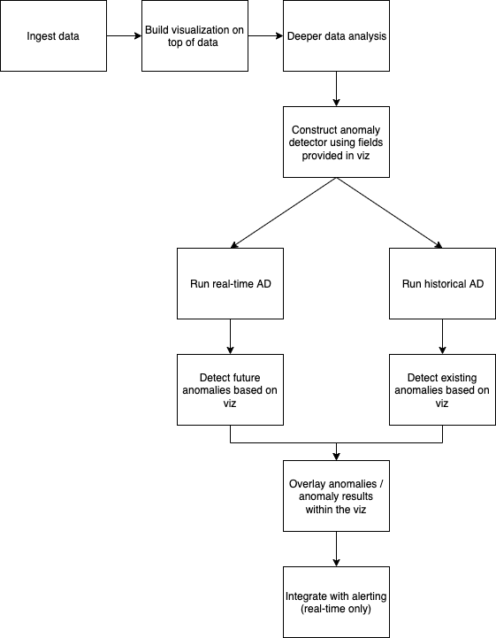

# RFC - Integration with Visualizations

## Problem

Oftentimes users may start out by viewing their ingested data through an OpenSearch Dashboards Visualization (viz), and then grouping multiple together to create a Dashboard. This is helpful to initially be able to understand the data, find patterns, and monitor / observe data as it’s ingested into an OpenSearch cluster. But, after users create these, there’s no clear path for them to take next steps if they want to look further into their data, such as setting up anomaly detection (AD). Some of the challenges of setting up AD include:

- learning new AD-specific terms and ideas (anomaly detector, historical analysis, feature, interval, etc.)
- detailed and lengthy setup with lots of user-required fields
- lots of duplicate work (selecting source data, metrics to analyze) if the user has already created a viz
- AD lives in a standalone plugin and not visible on Dashboards overview or home pages - must be accessed from list of plugins in sidebar

## Solution

### Overview

To help address this disconnect between Visualizations and AD, we propose an integrated solution that allows users to quickly create, run and view anomaly results from a Visualization. For certain Visualizations, users can utilize the effort they've already provided to visualize the data they’re interested in (source data, metrics to analyze), and create an anomaly detector on that same data with just a few extra clicks. The diagram shows the overall user workflow:

AD is only intended for use with streaming time series data (real-time or historical). Because of this, we focus on the following Visualization types frequently used for time series data: (1) Line, (2) Area, (3) Vertical bar, and (4) Time Series Visual Builder (TSVB).

### Generating the detector configuration

Using inputs from a Visualization, the config fields for a detector can be automatically populated with suggested values. In a perfect scenario, no user input is needed to create a detector, and every field can be populated. The most common cases where user info would be needed is the complex fields like features and filter query. These can be partially auto-filled, with some extra user input needed (e.g., auto-filling the feature field, but needing user input to provide a valid aggregation).

We list the logic for generating each default detector field value below:

| Detector field               | Logic                                                                                              |
| ---------------------------- | -------------------------------------------------------------------------------------------------- |
| `name`                       | Some simple pattern, e.g. `"<viz>-detector"`                                                       |
| `description`                | Some simple pattern, e.g. `"A detector based off of <viz>"`                                        |
| `time_field`                 | Time field used in viz                                                                             |
| `indices`                    | Selected index pattern of viz (if `Search` type is selected, then extract index pattern from that) |
| `features`                   | Corresponds to `metrics` section in viz. May need user input if invalid aggs are selected          |
| `filter_query`               | Combine any custom filters set in viz                                                              |
| `interval`                   | Use some default value (10 mins), or from length of bucket, if date histogram option is selected   |
| `window_delay`               | Use some default value (1 min)                                                                     |
| `category_field`             | Default to empty. If user has x-axis terms subaggregation set, could auto-fill with that field     |
| `result_index`               | Use some default value (none)                                                                      |
| `shingle_size`               | Use some default value (8)                                                                         |
| real-time / historical jobs? | Default to real-time enabled, historical disabled                                                  |

### Invalid inputs

Because Visualizations allow for much more complex ways to display data on a chart compared to AD, it is possible that the configuration will not all be valid when trying to set up an anomaly detector. Some examples include:

- user selects a metric aggregation available in a viz that is not available in AD (e.g. pipeline aggregation)
- user has more metrics than allowed features in AD (currently 5)
- user configures non-date-related x-axis or no x-axis at all

These cases could be handled in a few different ways:

1. Make AD creation invalid or unavailable until all constraints are met, and provide messaging as to why it's invalid.
2. Allow user to create by changing the detector config to meet constraints, but warn that the results may be based on different metrics than what's shown on the viz.

Note that x-axis issues won't necessarily affect the AD configuration, but would affect how any anomaly results would be displayed on the chart. Providing some warning indicating this may suffice.

Also note that AD supports custom aggregations when generating features. Future investigation needs to be done to see if all available viz aggregations could be converted appropriately.

### UX

#### Creation workflow

Creating a viz is very simple and only involves selecting a viz type and a source. The rest of the details (metrics, x-axis, all other settings) are set after it’s created. We can follow this strategy for AD by having a button in the viz details to create a detector, which could open some modal/flyout/etc. Depending on how much of the viz is populated/valid, we will autofill as many fields as possible following logic listed in the table above. When everything is valid, user can create the detector and start any real-time or historical detection jobs. The creation will then be disabled, and can instead have a link to the detector details in AD plugin.

#### Viewing results

Detector results could be displayed in a few different places. On the viz details page, results could be overlaid or annotated on the chart indicating when anomalies occurred. On a Dashboard containing an AD-enabled viz, we could link the detector or detector results within the viz panel, provide options to show AD results within the panel, or show as a separate component altogether. Additionally, for eligible viz’s that don’t have AD enabled, could have an option or a button to configure one, which could link to the AD creation section on the specified viz's details page, or possibly create directly from the existing page.

## Request for comments

We would like comments and feedback on the proposal of integrating AD and Visualizations [here](https://github.com/opensearch-project/anomaly-detection/issues/476). Some specific questions we’re seeking feedback include

- How do you use Visualizations today?
- Would you be more inclined to use AD if it was available to create within a Visualization?
- Are there any additional visualization aggregations not provided by AD, that are important for your use case? The current AD-supported aggregations can be found [here](https://opensearch.org/docs/latest/monitoring-plugins/ad/index/#add-features-to-your-detector).
- Do you envision viewing the anomalies in a different way than overlaid on Visualization charts?
- Would historical anomalies be useful, or are you only interested in real-time / future anomalies?
- Would you prefer auto-suggested fields to be hidden by default, or easily available to edit when creating?
- Besides integration with Visualizations, would you want a non-UI integration offering directly through APIs?
- Do you have any other suggestions for how to handle invalid inputs? Would you prefer a more or less restrictive approach?
